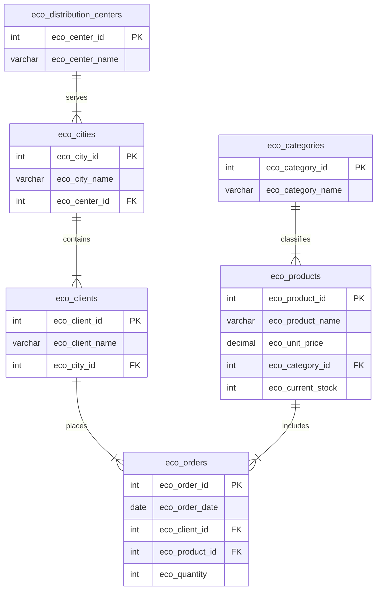

# EcoMarket Database Project (andres_cortes_esthercita)

This repository contains the complete relational database design, schema implementation, data seeding/loading guides, and SQL query suite for the **EcoMarket** business system.

---

## Project Description

**EcoMarket** is an end-to-end database implementation designed to streamline supply chain and sales tracking operations. The database manages essential retail entities: product categories, regional distribution hubs, municipal locations, clients, products, and order histories.

By transforming raw transaction logs into a fully normalized relational model, the system eliminates data redundancy, enforces referential integrity, and provides deep insights into inventory distribution, commercial activity, and financial performance.

---

## Technologies

* **Database Management System**: MySQL 8.0+
* **Storage Engine**: InnoDB (for ACID transactions and referential integrity)
* **Data Ingestion**: CSV format data loading
* **Diagramming**: Mermaid.js & Draw.io
* **Query Language**: SQL (ANSI SQL compliant)

---

## Database Engine

The system is built on **MySQL** utilizing the **InnoDB** storage engine. 

### Why InnoDB?
* **ACID Transactions**: Guarantees database operations are completed safely (Atomicity, Consistency, Isolation, Durability).
* **Foreign Key Constraints**: Enforces referential integrity at the database engine level (e.g., preventing orders for non-existent products or deleting cities with active clients without cascading operations).
* **Row-Level Locking**: Optimizes concurrent write performance, allowing multiple orders to be processed simultaneously without locking whole tables.
* **On Update/Delete Cascades**: Ensures that changes in parent records propagate correctly to child records.

---

## Normalization Process

To transition from raw, denormalized transactional spreadsheets to a structured, efficient relational system, the database was normalized up to the **Third Normal Form (3NF)**:

### 1. First Normal Form (1NF)
* **Atomic Values**: Ensure that every attribute contains only single, indivisible values. For example, client names and city addresses are stored separately.
* **Primary Keys**: Defined unique surrogate integer keys for each entity (e.g., `eco_product_id`, `eco_client_id`) to uniquely identify each row.
* **No Repeating Groups**: Eliminated multi-valued columns.

### 2. Second Normal Form (2NF)
* **Full Functional Dependency**: Eliminated partial dependencies on composite keys. Since all primary keys in our schema are single-column identifiers, any non-key attributes depend entirely on the primary key, automatically satisfying 2NF.
* **Entity Separation**: Segmented the data into distinct logical entities: Products, Categories, Distribution Centers, Cities, Clients, and Orders.

### 3. Third Normal Form (3NF)
* **No Transitive Dependencies**: Non-key attributes must not depend on other non-key attributes. 
  * *Example*: In an unnormalized form, a client's location determines their city, which in turn determines the distribution center. To eliminate the transitive dependency (Client -> City -> Distribution Center), the relationship is broken into:
    * `eco_clients` references `eco_cities` via `eco_city_id`.
    * `eco_cities` references `eco_distribution_centers` via `eco_center_id`.
  * Similarly, the product's category details are stored in `eco_categories` and referenced via `eco_category_id` in `eco_products`, avoiding repetitive text storage.

---

## Database Schema

The database consists of **6 tables**, prefixing all table names and columns with `eco_` to ensure namespace clarity.

```
                  +--------------------------+
                  | eco_distribution_centers |
                  +--------------------------+
                               | 1
                               |
                               | N
                        +------------+
                        | eco_cities |
                        +------------+
                               | 1
                               |
                               | N
                        +-------------+
                        | eco_clients |
                        +-------------+
                               | 1
                               |
                               | N
  +----------------+    +------------+    +--------------+
  | eco_categories |    | eco_orders |    | eco_products |
  +----------------+    +------------+    +--------------+
          | 1                 | N                | 1
          |                   |                  |
          +-------------------+------------------+
```

### Table Definitions

#### 1. `eco_categories`
Stores product categories.
* `eco_category_id` (INT, Primary Key): Unique category identifier.
* `eco_category_name` (VARCHAR(100), Unique, Not Null): Category name.

#### 2. `eco_distribution_centers`
Stores regional logistics hubs.
* `eco_center_id` (INT, Primary Key): Unique distribution center identifier.
* `eco_center_name` (VARCHAR(100), Unique, Not Null): Name of the center.

#### 3. `eco_cities`
Stores municipal regions mapped to their logistics hub.
* `eco_city_id` (INT, Primary Key): Unique city identifier.
* `eco_city_name` (VARCHAR(100), Unique, Not Null): City name.
* `eco_center_id` (INT, Foreign Key): References `eco_distribution_centers(eco_center_id)`.

#### 4. `eco_clients`
Stores clients and their municipal coordinates.
* `eco_client_id` (INT, Primary Key): Unique client identifier.
* `eco_client_name` (VARCHAR(100), Not Null): Name of the client.
* `eco_city_id` (INT, Foreign Key): References `eco_cities(eco_city_id)`.
* *Constraint*: `uq_client_city` (Unique key on name + city id) to prevent duplicate clients in the same city.

#### 5. `eco_products`
Stores product information and stock levels.
* `eco_product_id` (INT, Primary Key): Unique product identifier.
* `eco_product_name` (VARCHAR(100), Unique, Not Null): Product name.
* `eco_unit_price` (DECIMAL(10, 2), Not Null): Unit cost.
* `eco_category_id` (INT, Foreign Key): References `eco_categories(eco_category_id)`.
* `eco_current_stock` (INT, Not Null): Quantity available.

#### 6. `eco_orders`
Stores historical transactional orders.
* `eco_order_id` (INT, Primary Key): Unique order identifier.
* `eco_order_date` (DATE, Not Null): Order date.
* `eco_client_id` (INT, Foreign Key): References `eco_clients(eco_client_id)`.
* `eco_product_id` (INT, Foreign Key): References `eco_products(eco_product_id)`.
* `eco_quantity` (INT, Not Null): Number of items ordered.

---

## Entity Relationship Diagram

### Visual Representation (Mermaid.js)

You can render this diagram directly in compatible markdown viewers or paste it into Draw.io (Insert -> Advanced -> Mermaid):



---

## Database Creation Instructions

To create the database and tables from scratch, run the following SQL commands in your MySQL client:

```sql
-- 0. Recreate Database
DROP DATABASE IF EXISTS andres_cortes_esthercita;
CREATE DATABASE andres_cortes_esthercita
  CHARACTER SET utf8mb4
  COLLATE utf8mb4_unicode_ci;
USE andres_cortes_esthercita;

-- 1. Create eco_categories
CREATE TABLE eco_categories (
    eco_category_id INT NOT NULL,
    eco_category_name VARCHAR(100) NOT NULL UNIQUE,
    PRIMARY KEY (eco_category_id)
) ENGINE=InnoDB;

-- 2. Create eco_distribution_centers
CREATE TABLE eco_distribution_centers (
    eco_center_id INT NOT NULL,
    eco_center_name VARCHAR(100) NOT NULL UNIQUE,
    PRIMARY KEY (eco_center_id)
) ENGINE=InnoDB;

-- 3. Create eco_cities
CREATE TABLE eco_cities (
    eco_city_id INT NOT NULL,
    eco_city_name VARCHAR(100) NOT NULL UNIQUE,
    eco_center_id INT NOT NULL,
    PRIMARY KEY (eco_city_id),
    CONSTRAINT fk_cities_distribution_centers
        FOREIGN KEY (eco_center_id) REFERENCES eco_distribution_centers(eco_center_id)
        ON DELETE CASCADE ON UPDATE CASCADE
) ENGINE=InnoDB;

-- 4. Create eco_clients
CREATE TABLE eco_clients (
    eco_client_id INT NOT NULL,
    eco_client_name VARCHAR(100) NOT NULL,
    eco_city_id INT NOT NULL,
    PRIMARY KEY (eco_client_id),
    CONSTRAINT fk_clients_cities
        FOREIGN KEY (eco_city_id) REFERENCES eco_cities(eco_city_id)
        ON DELETE CASCADE ON UPDATE CASCADE,
    CONSTRAINT uq_client_city UNIQUE (eco_client_name, eco_city_id)
) ENGINE=InnoDB;

-- 5. Create eco_products
CREATE TABLE eco_products (
    eco_product_id INT NOT NULL,
    eco_product_name VARCHAR(100) NOT NULL UNIQUE,
    eco_unit_price DECIMAL(10, 2) NOT NULL,
    eco_category_id INT NOT NULL,
    eco_current_stock INT NOT NULL,
    PRIMARY KEY (eco_product_id),
    CONSTRAINT fk_products_categories
        FOREIGN KEY (eco_category_id) REFERENCES eco_categories(eco_category_id)
        ON DELETE CASCADE ON UPDATE CASCADE
) ENGINE=InnoDB;

-- 6. Create eco_orders
CREATE TABLE eco_orders (
    eco_order_id INT NOT NULL,
    eco_order_date DATE NOT NULL,
    eco_client_id INT NOT NULL,
    eco_product_id INT NOT NULL,
    eco_quantity INT NOT NULL,
    PRIMARY KEY (eco_order_id),
    CONSTRAINT fk_orders_clients
        FOREIGN KEY (eco_client_id) REFERENCES eco_clients(eco_client_id)
        ON DELETE CASCADE ON UPDATE CASCADE,
    CONSTRAINT fk_orders_products
        FOREIGN KEY (eco_product_id) REFERENCES eco_products(eco_product_id)
        ON DELETE CASCADE ON UPDATE CASCADE
) ENGINE=InnoDB;
```

---

## Data Loading Instructions

### Pre-requisites
Enable local data loading in the MySQL server before initiating your terminal session:
```sql
SET GLOBAL local_infile = 1;
```
Connect to your MySQL CLI passing the `--local-infile=1` flag:
```bash
mysql --local-infile=1 -u your_username -p
```

### Ingestion Scripts
The tables **must be populated in strict order** to respect foreign key constraints:

```sql
-- 1. Import eco_categories
LOAD DATA LOCAL INFILE '/home/cohorte5/Documentos/FACZ-21/PerformanceTest-DB/csv_data/categories.csv'
INTO TABLE eco_categories
FIELDS TERMINATED BY ',' OPTIONALLY ENCLOSED BY '"'
LINES TERMINATED BY '\n'
IGNORE 1 LINES
(eco_category_id, eco_category_name);

-- 2. Import eco_distribution_centers
LOAD DATA LOCAL INFILE '/home/cohorte5/Documentos/FACZ-21/PerformanceTest-DB/csv_data/distribution_centers.csv'
INTO TABLE eco_distribution_centers
FIELDS TERMINATED BY ',' OPTIONALLY ENCLOSED BY '"'
LINES TERMINATED BY '\n'
IGNORE 1 LINES
(eco_center_id, eco_center_name);

-- 3. Import eco_cities
LOAD DATA LOCAL INFILE '/home/cohorte5/Documentos/FACZ-21/PerformanceTest-DB/csv_data/cities.csv'
INTO TABLE eco_cities
FIELDS TERMINATED BY ',' OPTIONALLY ENCLOSED BY '"'
LINES TERMINATED BY '\n'
IGNORE 1 LINES
(eco_city_id, eco_city_name, eco_center_id);

-- 4. Import eco_clients
LOAD DATA LOCAL INFILE '/home/cohorte5/Documentos/FACZ-21/PerformanceTest-DB/csv_data/clients.csv'
INTO TABLE eco_clients
FIELDS TERMINATED BY ',' OPTIONALLY ENCLOSED BY '"'
LINES TERMINATED BY '\n'
IGNORE 1 LINES
(eco_client_id, eco_client_name, eco_city_id);

-- 5. Import eco_products
LOAD DATA LOCAL INFILE '/home/cohorte5/Documentos/FACZ-21/PerformanceTest-DB/csv_data/products.csv'
INTO TABLE eco_products
FIELDS TERMINATED BY ',' OPTIONALLY ENCLOSED BY '"'
LINES TERMINATED BY '\n'
IGNORE 1 LINES
(eco_product_id, eco_product_name, eco_unit_price, eco_category_id, eco_current_stock);

-- 6. Import eco_orders
LOAD DATA LOCAL INFILE '/home/cohorte5/Documentos/FACZ-21/PerformanceTest-DB/csv_data/orders.csv'
INTO TABLE eco_orders
FIELDS TERMINATED BY ',' OPTIONALLY ENCLOSED BY '"'
LINES TERMINATED BY '\n'
IGNORE 1 LINES
(eco_order_id, eco_order_date, eco_client_id, eco_product_id, eco_quantity);
```

> [!TIP]
> **Troubleshooting Windows Line Endings**: If the CSV files contain Windows-style line endings (`\r\n`), modify the `LINES TERMINATED BY` parameter to `'\r\n'` to prevent ingestion formatting errors.

---

## SQL Query Explanation

Below is an overview of the queries designed for business operations, divided into DQL (Data Query Language) and DML (Data Manipulation Language) categories. Complete query scripts are located in [andres_cortes_esthercita_consultas.txt](file:///home/cohorte5/Documentos/FACZ-21/PerformanceTest-DB/andres_cortes_esthercita_consultas.txt).

### DQL (Selection Queries)

* **Query 1: Available inventory per product**
  * *Purpose*: Lists all items with their current stock levels and categories.
  * *Logic*: JOINs `eco_products` and `eco_categories` on `eco_category_id`. Sorts by inventory DESC, then product name ASC. Useful for procurement planning.
* **Query 2: Order history by city**
  * *Purpose*: Summarizes order volume and units requested per city.
  * *Logic*: Relates cities to clients, then clients to orders. Groups by city, returning the total count of orders and the sum of ordered quantities. Sorted by volume DESC.
* **Query 3: Total sales by category**
  * *Purpose*: Evaluates revenue generated by category.
  * *Logic*: Aggregates order item quantities, multiplying them by their respective product unit prices. Sorted by revenue DESC to identify highly profitable categories.
* **Query 4: Products with low inventory**
  * *Purpose*: Lists products near out-of-stock.
  * *Logic*: Sorts products in ASC order of current stock. Allows supply chain operators to identify low stock levels.
* **Query 5: Clients with the highest number of orders**
  * *Purpose*: Locates active repeat clients.
  * *Logic*: Counts total orders and sums total units bought, grouping by client.
* **Query 6: Financial value of inventory by distribution center**
  * *Purpose*: Valuation of current stock mapped to distribution centers.
  * *Logic*: Since products are not explicitly assigned to a distribution center in the stock schema, this query uses a subquery to find active client orders. It matches client cities to distribution centers, determining which center ships which product. Using `SUM(stock * unit_price)`, it aggregates inventory value per center.

### DML (Data Manipulation Scripts)

The DML scripts demonstrate execution of basic CRUD operations while observing relational foreign key restrictions:
* **Insertions**: Safely registers new products, clients, and orders.
* **Updates**:
  * Price changes on products.
  * Stock increases during replenishment.
  * Stock decreases during sales (employing a check `eco_current_stock >= quantity` to prevent negative stock).
* **Deletions**:
  * Deletes specific orders.
  * Deletes inactive clients who have no historical orders (enforcing referential check using `NOT IN`).

---

## Developer Information

This relational schema, implementation guidelines, and DQL/DML suite were designed and implemented by:

* **Andrés Cortés**
* **Esthercita**
